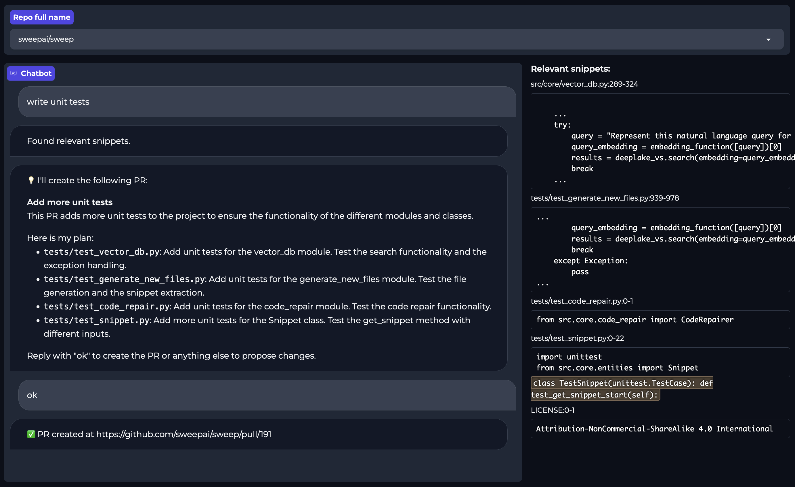

<p align="center">
    
</p>
<p align="center">
    <i>Spend time reviewing code generated by AI, not writing it.</i>
</p>

<p align="center">
<a href="https://docs.sweep.dev/">📚 Docs</a>
<span>&nbsp;&nbsp;•&nbsp;&nbsp;</span>
<a href="https://discord.gg/sweep-ai">📢 Discord</a>
</p>

<b>Sweep</b> allows you to create and review GitHub issues with easy.
Simply describe any issue and Sweep will do the rest.
It will plan out what needs to be done, what changes to make, and write the changes to a PR. 

---

## ✨ Demo
For the best experience, [install Sweep](https://github.com/apps/sweep-ai) to one of your repos and see the magic happen.

[Demo](https://github.com/sweepai/sweep/assets/44910023/365ec29f-7317-40a7-9b5e-0af02f2b0e47)

## 🚀 Getting Started

### 🖥️ Sweep Chat
Sweep Chat allows you to interact with Sweep locally and will sync with GitHub. You can plan out your changes with Sweep, and then Sweep can create a pull request for you. 

1. Install [Sweep GitHub app](https://github.com/apps/sweep-ai) to desired repos

2. Run the following script
```sh
pip install sweepai
sweep
```

3. This should spin up a GitHub auth flow in your browser. Copy-paste the 🔵 blue 8-digit code from your terminal into the page. Then wait a few seconds and it should spin up Sweep Chat. You should only need to do the auth once.

4. Pick a repo from the dropdown at the top (the Github app must be installed on this repo). Then start chatting with Sweep Chat. Relevant searched files will show up on the right. Sweep Chat can make PRs if you ask it to create a PR. 


💡 You can force dark mode by going to http://127.0.0.1:7861/?__theme=dark.

### ✨ Sweep Github App
Set ting up Sweep is as simple as adding the GitHub bot to a repo, then creating an issue for the bot to address.

1. Add the [Sweep GitHub app](https://github.com/apps/sweep-ai) to desired repos
2. Create new issue in repo, like "Sweep: Write tests"
3. "👀" means it is taking a look, and it will generate the desired code
4. "🚀" means the bot has finished its job and created a PR

For more detailed docs, see [🚀 Quickstart](https://docs.sweep.dev/start).

---

## 📘 Story

We were frustrated by small tickets, like simple bug fixes, annoying refactors, and small features, each task requiring us to open our IDE to fix simple bugs. So, we decided to leverage the capabilities of ChatGPT to address this directly in GitHub.

Unlike existing AI solutions, this can solve entire tickets and can be parallelized: developers can spin up 10 tickets and Sweep will address them all at once.

## 📚 The Stack
- GPT-4 32k 0613 (default) / Claude v1.3 100k
- ActiveLoop DeepLake for Vector DB with MiniLM L12 as our embeddings model
- Modal Labs for infra + deployment

## 🌠 Features
* Automatic feature development
* PR auto self-review + comment handling (effectively [Reflexion](https://arxiv.org/abs/2303.11366))
* Address developer comments after PR is created
* Code snippets embedding-based search
* Chain-of-Thought retrieval using GPT Functions

## 🗺️ Roadmap
We're currently working on responding to linters and external search. For more, see [🗺️ Roadmap](https://docs.sweep.dev/roadmap).

---


<h2 align="center">
    Contributors
</h2>
<p align="center">
    Thank you for your contribution!
</p>
<p align="center">
    <a href="https://github.com/sweepai/sweep/graphs/contributors">
      
    </a>
</p>
<p align="center">
    and, of course, Sweep!
</p>
