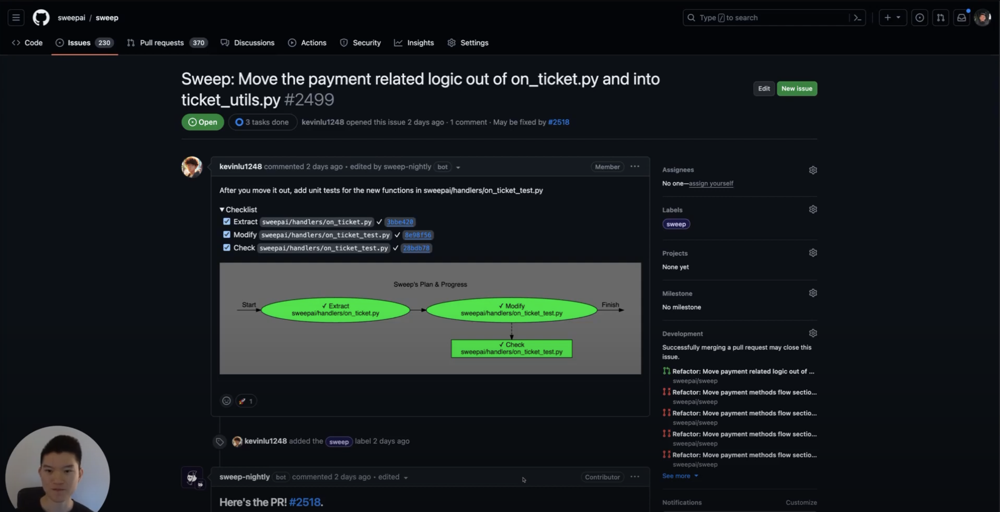

    

    <i>Github Issues ⟶&nbsp; Refactored and Tested Python Code! </i>

    
    
    
    
    
    
    

*🎊 We recently updated our README to reflect our improvements to Python refactors and unit tests!*

---

<b>Sweep</b> is an AI junior developer that refactors and writes unit tests for Python. :snake: :robot:

[Install Sweep](https://github.com/apps/sweep-ai) and open a Github Issue like: `Sweep: Refactor the run function in main.py` and Sweep will:
1. Identify the best places to refactor your code
2. Refactor and add unit tests through Github
3. **Run and debug your code to open a Pull Request** ⚡

### Features

* Turns issues directly into pull requests (without an IDE)
* Addresses developer replies & comments on its PRs
* Understands your codebase using the dependency graph, text, and vector search.
* Runs your unit tests and autoformatters to validate generated code.

---
### What makes Sweep Different

We've been addressing code modification using LLMs for a while. We found and are fixing a lot of issues.

-  **Refactoring Code** LLMs are bad at refactoring code. It's really challenging for them to extract all of the necessary parameters.  Check out https://docs.sweep.dev/blogs/refactor-python!
   * Sweep solves this by using Rope and our custom DSL to perform perfect refactors every time!
-  **Unit Test** Most AI unit test copilots don't even validate the code. They leave it to the user to make sure the generated code works, which is half of the battle. Check out https://docs.sweep.dev/blogs/ai-unit-tests!
   * Sweep runs your code for you, which catches bugs and makes sure each line of old and new code has been properly validated!
- **Formatting** LLMs are also bad at properly formatting code, such as by adding typehints and making sure we use tabs instead of spaces. Check out https://docs.sweep.dev/blogs/super-linter!
   * Sweep uses it's sandbox to format your code, and uses [Rules](https://docs.sweep.dev/usage/config#tips-for-writing-rules) to perform other changes like adding typehints, or any other small chores!

---

## Getting Started

### GitHub App
Install Sweep by adding the [**Sweep GitHub App**](https://github.com/apps/sweep-ai) to your desired repositories.

* For more details, visit our [Installation page](docs/installation.md).

* Note: Sweep only considers issues with the "Sweep:" title on creation and not on update. If you want Sweep to pick up an issue after it has been created, you can add the "Sweep" label to the issue.

* We focus on Python but support all languages GPT-4 can write. This includes JS/TS, Rust, Go, Java, C# and C++.

### Self-Hosting

You can self-host Sweep with our Docker image (`https://hub.docker.com/r/sweepai/sweep`). Please check out our deployment instructions here! https://docs.sweep.dev/deployment

## Development

### Starting the Webhook
1. Clone the repo with `git clone https://github.com/sweepai/sweep`.
2. Create `.env` according to https://docs.sweep.dev/deployment.
3. Run `docker compose up --build`. This will take a few moments to start.

To build our Docker images, run `docker compose build`.

---

## Story

We used to work in large, messy repositories, and we noticed how complex the code could get without regular refactors and unit tests. We realized that AI could handle these chores for us, so we built Sweep!

Unlike existing AI solutions, Sweep can solve entire tickets and can be parallelized + asynchronous: developers can spin up 10 tickets and Sweep will address them all at once.

## The Stack
- **GPT-4 32k**
- Code Search Engine using Python AST
- Code Sandbox
- Programmatic refactors using [Rope](https://github.com/python-rope/rope)!

## Highlights
Examine pull requests created by Sweep [here](https://docs.sweep.dev/about/examples).

## Pricing
Every user receives unlimited GPT-3.5 tickets and 5 GPT-4 tickets per month. For professionals who want to try unlimited GPT-4 tickets and priority support, you can get a one week free trial of [Sweep Pro](https://buy.stripe.com/00g5npeT71H2gzCfZ8).

For more GPT-4 tickets visit <a href='https://buy.stripe.com/00g3fh7qF85q0AE14d'>our payment portal</a>!

You can [self-host](https://docs.sweep.dev/deployment) Sweep's docker image on any machine (AWS, Azure, your laptop) for free. You can get enterprise support by [contacting us](https://form.typeform.com/to/wliuvyWE).

---

## Limitations of Sweep

* **Gigantic repos**: >5000 files. We have default extensions and directories to exclude but sometimes this doesn't catch them all. You may need to block some directories (see [`blocked_dirs`](https://docs.sweep.dev/usage/config#blocked_dirs))
    * If Sweep is stuck at 0% for over 30 min and your repo has a few thousand files, let us know.

* **Large-scale refactors**: >3 files or >150 lines of code changes
    * e.g. Refactor the entire codebase from TensorFlow to PyTorch
    * Sweep works best when pointed to a file, and we're continously improving Sweep's automation!

* **Editing images** and other non-text assets
    * e.g. Use the logo to create favicons for our landing page
---

## Contributing

Contributions are welcome and greatly appreciated! To get set up, see [Development](https://github.com/sweepai/sweep#development). For detailed guidelines on how to contribute, please see the [CONTRIBUTING.md](CONTRIBUTING.md) file.

<h2 align="center">
    Contributors
</h2>

    Thank you for your contribution!

    

    and, of course, Sweep!

